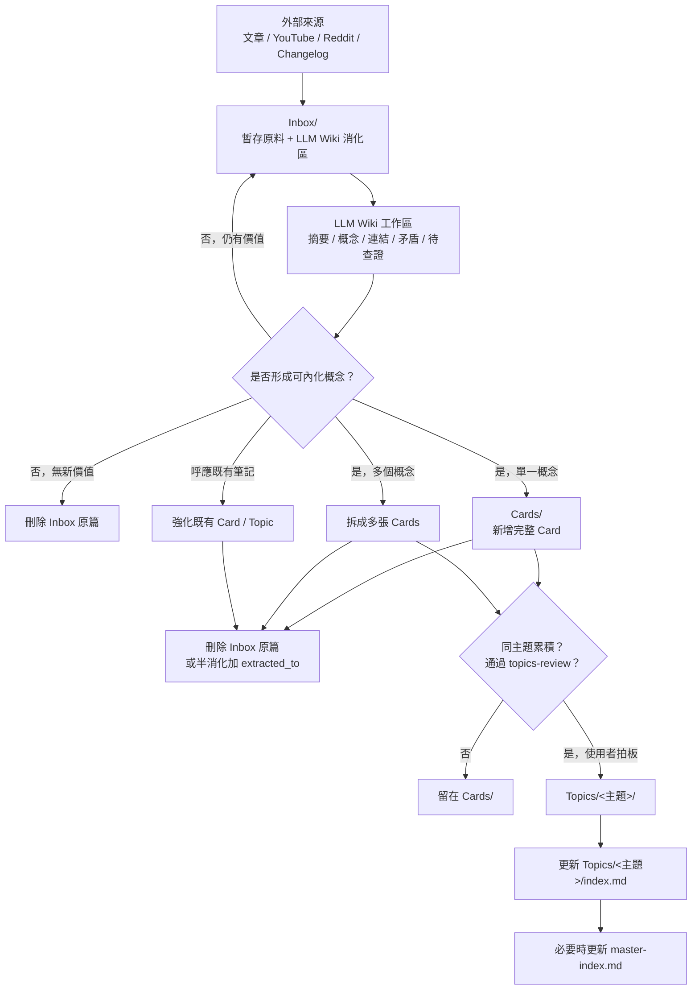

## 定位

LLM Wiki 方法只放在 `Inbox/` 階段，作為外部來源的消化工作台；`Cards/` 與 `Topics/` 仍維持吸收型卡片盒的品質門檻。

一句話：

```text
外部來源 -> Inbox 內做 LLM Wiki 式整理 -> 成熟後抽成 Card -> 多張 Card 累積後升 Topic
```

## 資料夾角色

| 位置 | 角色 | 不做什麼 |
|---|---|---|
| `Inbox/` | 暫存原料 + LLM Wiki 消化工作區 | 不當長期知識本體 |
| `Cards/` | 內化後的單一完整概念 | 不放來源摘要或半成品 |
| `Topics/<主題>/` | 成熟主題集合 + 主題入口頁 | 不由 agent 自主升級 |
| `master-index.md` | 全域導航與 tag guide | 不做全量 catalog |

## 流程圖



## Inbox 內部格式

外部來源進入 `Inbox/` 後，可以在正文加入下列工作區。這些段落只屬於 Inbox 消化階段，升成 Card 時不能原樣搬運，必須改寫成內化後的概念筆記。

```md
## LLM Wiki 工作區

### 來源重點

### 可抽出的概念

### 相關既有筆記

### 張力 / 矛盾 / 待查證

### 升 Card 候選

### 處置建議
```

## 升 Card 門檻

Inbox note 夠完整不等於可以升 Card。必須同時符合：

- 是單一完整概念，不是多主題雜燴。
- 不靠原文也能讀懂。
- 不是來源摘要。
- 有我的判斷、取捨、方法或踩坑。
- 已檢查相關既有 `Cards/` / `Topics/`，避免重複。
- `source` 保留為回查用，但正文不把原文當證據堆疊。

若一篇 Inbox 同時產生多個概念，拆成多張 Cards；若只消化其中一個切角，保留未消化段落並在 frontmatter 加：

```yaml
extracted_to: "[[<MOC 名>]]"
```

## Inbox 的三種出口

每篇 Inbox 最終只能走三條路：

1. **升成新 Card**：真有新啟發，且已內化成單一完整概念。
2. **強化既有 Card / Topic**：呼應舊想法，只把新判斷補進既有筆記。
3. **刪除**：沒學到新東西、品質差、或已被完整吸收。

三條路都以清空或標記該 Inbox 筆記為目標。Inbox 不是永久倉庫。

## 操作原則

- LLM Wiki 是 Inbox 階段的方法，不是最終知識架構。
- `Cards/` 的品質門檻不因 Inbox 工作區變完整而降低。
- `Topics/` 仍按 `topics-review.md` 審核，且需使用者拍板才升級。
- 不新增 frontmatter 欄位；優先用正文 section 表示工作狀態。
- 不新增 command；若要自動化，優先修改既有 skill 流程。

## 試點

建議先用 `Inbox/Clippings/llm-wiki.md` 試跑：

1. 在原 Inbox 筆記補 `LLM Wiki 工作區`。
2. 判斷可抽出的 Card 候選。
3. 先產一張最小 Card，例如 `LLM-Wiki-作為-Inbox-消化方法`。
4. 若原文已完整吸收，刪除 Inbox；若還有其他切角，保留未消化段落並標 `extracted_to`。
