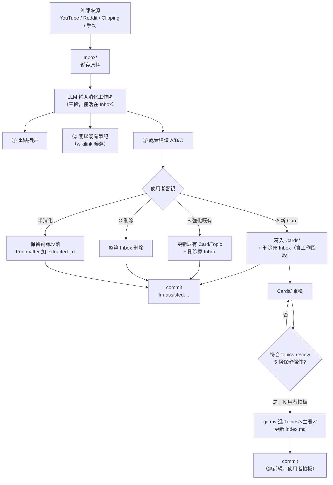

# LLM Wiki 變更計劃（待拍板）

> 本檔合併原 `LLM-Wiki-Inbox-消化流程.md` 試點折衷案 + 三輪 subagent 對抗辯論的仲裁結論，作為**單一完整計劃**。原試點檔已刪除（git rm），由本檔取代。拍板後依 §12 動工順序執行。

## 1. 緣起

`Inbox/Clippings/llm-wiki.md`（Karpathy 的 LLM Wiki 模式）vs 本 vault 現行「吸收型卡片盒」架構，經三輪對抗辯論：

| 輪 | LLM Wiki 派 | 卡片盒派 |
|---|---|---|
| R1 | 全 vault 改造、廢拍板、Topics 變活躍區、加 log.md、Raw/ 不可變層 | 三條原則沒得讓；折衷案還要更收緊 |
| R2 | 改提分流方案：`Topics/個人/` 不動、`Topics/參考/` 走 LLM Wiki；撤回 Raw/ | 接受工作區精簡、commit 前綴；拒絕分流 |
| R3 仲裁 | 核心三項（分流／自主升 Topics／log.md）全駁回；保留問題診斷 | 底線全守；接受三項讓步 |

## 2. 仲裁判決

**卡片盒派主論點勝出**，三條理由：

1. **目標錯位**：vault 唯一讀者是個人，不是團隊知識庫。LLM Wiki 的「交叉引用密度」北極星指標是團隊場景，套到「腦的延伸」上目標錯了
2. **寫 = 內化**：技術主題的 vault 價值是「我踩過的坑、我的工作流」，不是 API 規格（後者已走 WebFetch）
3. **vault-distill 已存在**：「LLM 輔助 + 使用者拍板」的複利路徑運作中，LLM Wiki 派沒論證為何不足

**LLM Wiki 派核心三項（分流方案／自主升 Topics／log.md）全駁回**，但其診斷的三個真問題（Inbox 消化效率、可追溯性、Clippings 模糊）有對應措施。

---

## 3. 定位與資料夾角色

LLM 輔助方法**只放在 `Inbox/` 階段**作為消化工作台；`Cards/` 與 `Topics/` 仍維持吸收型卡片盒的品質門檻。

```text
外部來源 → Inbox 內做 LLM 輔助消化 → 成熟後抽成 Card（人工確認）→ 多張 Card 累積後升 Topic（使用者拍板）
```

| 位置 | 角色 | 不做什麼 |
|---|---|---|
| `Inbox/` | 暫存原料 + LLM 輔助消化工作區 | 不當長期知識本體 |
| `Inbox/Clippings/` | Inbox 子類，豁免 schema | 不長期積累，消化路徑同 Inbox |
| `Cards/` | 內化後的單一完整概念 | 不放來源摘要或半成品 |
| `Topics/<主題>/` | 成熟主題集合 + 主題入口頁 | **不由 agent 自主升級** |
| `master-index.md` | 全域導航與 tag guide | 不做全量 catalog |

## 4. 流程圖



**邊界說明**：LLM 主導寫入區域（工作區、A/B/C/半消化處置）commit 加 `llm-assisted:` 前綴；使用者拍板節點（審視、升 Topic）commit 無前綴。

## 5. Inbox 消化工作區規格（三段位）

外部來源進入 `Inbox/` 後，在正文加入下列三段工作區。**僅存活於 Inbox 階段**，升 Card 時必須完整刪除工作區段、不能搬運。

```md
## 消化工作區（LLM 輔助）

### ① 重點摘要
<3-5 句濃縮，不超過原文 1/5 篇幅>

### ② 關聯既有筆記
- [[既有 Card/Topic 1]] — 切點：<為何相關>
- [[既有 Card/Topic 2]] — 切點：...

### ③ 處置建議
建議路徑：A 新 Card / B 強化既有 / C 刪除 / 半消化
理由：<一兩句>
若 A：擬議 Card 標題 + 核心概念
若 B：擬議要更新哪張既有筆記、補什麼判斷
若 C：無新啟發 / 品質差 / 已被吸收
若半消化：本次消化哪一切角、剩餘段落歸屬 `extracted_to: "[[<MOC>]]"`
```

**與原試點案差異**：
- 砍掉「來源重點 / 可抽出概念 / 張力矛盾 / 待查證 / 升 Card 候選 / 處置建議」六段，整併為三段
- 降低 Inbox 沉澱誘因（段位太多會讓人捨不得刪）
- 「LLM 不得自主執行 `git mv` 進 `Topics/`」明文化

## 6. 升 Card 門檻

Inbox 工作區寫得完整不等於可升 Card，必須同時符合：

- 是單一完整概念，不是多主題雜燴
- 不靠原文也能讀懂
- 不是來源摘要
- 有我的判斷、取捨、方法或踩坑
- 已檢查相關既有 `Cards/` / `Topics/`，避免重複
- `source` 保留為回查用，但正文不把原文當證據堆疊

若一篇 Inbox 同時產生多個概念 → 拆成多張 Cards；若只消化其中一個切角 → 保留未消化段落並在 frontmatter 加 `extracted_to: "[[<MOC 名>]]"`。

## 7. 三種出口（+ 半消化例外）

每篇 Inbox 最終走四條路之一：

1. **A 升新 Card**：真有新啟發，且已內化成單一完整概念
2. **B 強化既有 Card / Topic**：呼應舊想法，只把新判斷補進既有筆記
3. **C 刪除**：沒學到新東西、品質差、或已被完整吸收
4. **半消化保留**：多主題筆記僅消化其中一個切角，剩餘段落保留 + `extracted_to`

**升 Card 後必須立即刪原 Inbox**（含工作區段），不留備份。Inbox 不是永久倉庫。

## 8. 配套規則（修 `obsidian-memory/CLAUDE.md`）

### (a) LLM 輔助 commit 規範

- **LLM 主導寫入 vault 的 commit 訊息強制加前綴** `llm-assisted:`
- 使用者拍板的批次搬移 / 升 Topic 不加前綴
- 作用：取代 log.md，零 schema 成本，git history 即審計層
- 範例：
  - `llm-assisted: 消化 Inbox/Clippings/llm-wiki，升 Card`
  - `升 Topic：Claude-Code-雙帳號設定` （無前綴）

### (b) Clippings 生命週期

- Clippings 為 Inbox 子類，繼續豁免 schema
- 消化路徑同 Inbox 三條清空路徑（A / B / C 或半消化）
- **不得長期積累**——逾期 14 天未消化視為訊號需檢討

### (c) 純規格走 WebFetch，不入 vault

- 明文化全域 `obsidian.md` 已隱含原則
- API 規格、flag 列表、語法 cheatsheet 不抄進 vault，需要時 WebFetch 官方來源
- 範例：Nuxt 4 composables、Claude Code slash command 全表、Obsidian Bases 語法

### 不動的既有規則

- 「升 Topic 不由 agent 自主執行」一字不動
- 三層成熟度（Inbox/Cards/Topics）不動
- `topics-review.md` 5 條保留條件 + 7 條反指標不動
- `vault-schema.mjs` 白名單不擴充

## 9. 明確不做的事

| 項目 | 不做理由 |
|---|---|
| 新增 `log.md` | git history + commit prefix 已足夠，加檔案違反「不在多處重複」 |
| 擴充 `vault-schema.mjs` 白名單 | 無新欄位需求 |
| 新增 `Raw/` 不可變原料層 | LLM Wiki 派 R2 已自行撤回 |
| 新增 `Topics/參考/` 分流目錄 | 會變 LLM 規格鏡像，與 WebFetch 重疊且失去「我的版本」 |
| 開放 LLM 自主升 Topics | vault 是誰的，不可讓 |
| 「跨檔 wikilink 密度」成功指標 | 可能是 LLM 自我引用噪音，不可驗證 |
| 新增 command / skill | 修既有 skill 流程優先（CLAUDE.md 已規定） |

## 10. 試點規格

- **範圍**：20 篇 Inbox 筆記、14 天
- **標的**：使用者自選當下 Inbox 積壓最重的主題
- **成功標準（須同時達標）**：
  - ≥70% 處置率（升 Card / 強化既有 / 明確刪除，無懸而未決）
  - 使用者抽查 LLM 處置建議反悔率 < 20%
  - 試點期間 `/vault-check` 0 個新型 schema 違規
- **退場**：未達標即 `git revert` 兩份文件修訂；`llm-assisted:` commit prefix 規範可獨立保留（無害且增加可追溯性）

## 11. 8 週後長期觀察

**擴大條件**：試點達標 + Inbox 停留中位數降 ≥30% + 0 次撤回事件

- 擴大方向**僅限**：工作區應用到更多 Inbox 子目錄（YouTube / Reddit / Clippings）
- **永久不擴大**到 Topics 自主維護

**整案撤回條件**：

1. 試點 14 天未達 70% 處置率
2. 反悔率連續兩週 >20%
3. LLM 寫入污染既有 Cards/Topics 事件（透過「強化既有 Card」路徑）

## 12. 動工順序（拍板後）

1. 改 `obsidian-memory/CLAUDE.md` — 新增 §8 三條規則
2. 一次 commit，訊息**不加** `llm-assisted:`（這是使用者拍板的規則變更）
3. 開始試點，從下一篇 Inbox 進來時套用

## 13. 兩派立場對照

| 項目 | LLM Wiki 派 | 卡片盒派 | 仲裁採納 |
|---|---|---|---|
| 升 Topic 自主 | 守住 | 不退 | 卡片盒派 |
| log.md | 守住 | 拒絕 | commit prefix（變體） |
| 分流方案 | 守住 | 拒絕 | 卡片盒派 |
| 工作區精簡 | — | 讓步 | 採納（六→三段） |
| Clippings 規則 | — | 讓步 | 採納 |
| 純規格不入 vault | 部分同意 | 提出 | 採納 |
| 試點 20 篇 / 14 天 | 接受 | 接受 | 採納 |
| 70% 處置率 | 拒絕 | 提出 | 採納 |

## 14. 操作原則（給後續使用者與 agent）

- LLM 輔助是 Inbox 階段的方法，不是最終知識架構
- `Cards/` 的品質門檻不因 Inbox 工作區變完整而降低
- `Topics/` 仍按 `topics-review.md` 審核，且需使用者拍板才升級
- 不新增 frontmatter 欄位；優先用正文 section 表示工作狀態
- 不新增 command；若要自動化，優先修改既有 skill 流程
- LLM 主導寫入 vault 必加 `llm-assisted:` commit 前綴
