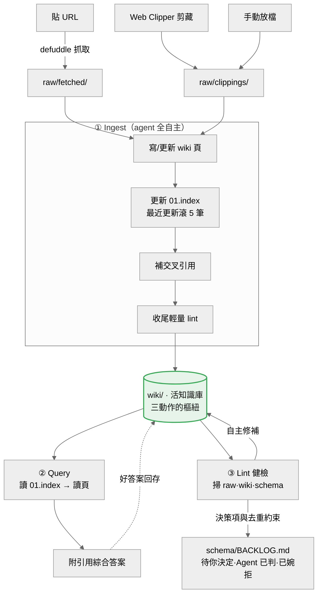
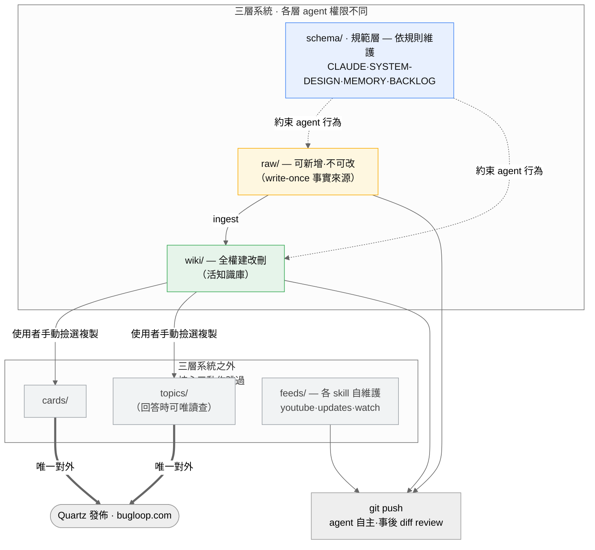

# Obsidian Memory Vault

個人 Obsidian vault，採 Karpathy [LLM Wiki](https://gist.github.com/karpathy/442a6bf555914893e9891c11519de94f) 工作流：agent 讀不可變的 `raw/` 原料，漸進維護一套互聯的 `wiki/` 活知識庫。`cards/`、`topics/` 是使用者私人策展區，也是對外公開的層。公開版本在 [bugloop.com](https://bugloop.com)。

## 系統概覽

vault 的維護就是三個動作（Ingest／Query／Lint），只在 `raw/`＋`wiki/` 上進行，不碰 `cards/topics/feeds`。`schema/` 不屬 raw／wiki 內容層；Lint 會額外掃描它並維護 `schema/BACKLOG.md`。可直接處理的 findings 由 agent 當場修補，只有真正需要使用者決策的項目才進「待你決定」；「Agent 已判」與「已婉拒」則保留為去重約束。



三層架構與 agent 的寫入邊界——**無硬守門**；異常大面積 ingest 與 skill 變更另有流程級確認點：



圖 2 的顏色即 agent 權限，三層權限刻意不同：

- 🟦 **schema/（規範層）** — 定義 agent 怎麼維護這個 vault 的規則層。它**約束** agent、不是 agent 的產出物；agent 只在規則允許下維護其中的操作狀態（`MEMORY.md`、`BACKLOG.md`），治理文件（`CLAUDE.md`、`SYSTEM-DESIGN.md`）由使用者定調。箭頭朝下＝schema 管 raw／wiki，不是反過來。
- 🟨 **raw/（write-once）** — 事實來源，agent 可新增、落地後凍結不改。
- 🟩 **wiki/（全權）** — 活知識庫，agent 自由建改刪，是唯一被 agent 完全掌管的層。
- ⬜ **cards・topics・feeds** — 三動作全部跳過：cards／topics 是使用者私人策展＋唯一對外發佈層（agent 只在回答時可唯讀查 topics），feeds 由各 skill 自維護。

**沒有硬守門**——`git push` 亦由 agent 自主執行（2026-07-20 拍板移除原「push 前須明確同意」守門）。它會把 raw／wiki／feeds 一併推上遠端，該次 diff 由使用者事後在 GitHub 把關；force push 不在此授權內，仍需明確要求。wiki 日常維護同樣由 agent 自主；另有兩個流程級確認點：單次 ingest 預計觸及超過 15 頁，以及新增或修改 skill。

## 安裝與使用

```bash
git clone https://github.com/lllloo/obsidian-memory.git
```

**Prerequisites**：

- [Obsidian](https://obsidian.md/) — 編輯與圖譜瀏覽
- Python 3 — skill 腳本執行所需；Windows 建議先設機器級 `PYTHONUTF8=1`，避免 cp950 編碼問題
- `pip`（`vault-youtube-sync`）— 首次執行會自動安裝 `youtube-transcript-api`
- [GitHub CLI](https://cli.github.com/)（`vault-watch`）— 建議先執行 `gh auth login`，可提高 API rate limit
- `claude`、`codex` 或 `opencode` CLI 其中之一（`ask-vault`）— 需完成對應登入
- [Obsidian CLI](https://help.obsidian.md/cli)（選用）— 本地開檔輔助，不影響任何流程

在 Obsidian 直接「Open folder as vault」開啟本 repo 即可閱讀編輯。支援 [Agent Skills](https://agentskills.io) 的 AI 工具可載入 `.agents/skills/`；Claude Code 也可用 `/<skill>` 喚起。維護型 skill 在 repo 根目錄執行，跨專案唯讀查詢則使用 `ask-vault`。

> 原本的全域 `ob-write`／`ob-read` 已移除；其中「從其他專案查詢 vault」的情境已由 [`ask-vault`](./.agents/skills/ask-vault/SKILL.md) 重建。它會依呼叫環境選用 `claude`／`codex`／`opencode` 執行唯讀 headless Query，並自行把查詢程序放在 vault root、檢查 CWD 哨兵；不提供跨專案寫入。

新 clone 不會自動建立全域 skill 入口。若要從其他 repo 觸發 `ask-vault`，需將 `.agents/skills/ask-vault` 安裝或 symlink 到所用工具的全域 Agent Skills 目錄；目前的共用入口是 `~/.agents/skills/ask-vault`，Claude 相容入口再由 `~/.claude/skills/ask-vault` 指向它。

## 結構

三層系統（資料夾完整索引見 [`schema/vault-map.md`](./schema/vault-map.md)）：

- `raw/` — 原始來源，write-once（agent 可新增、不可修改，事實來源）
  - `clippings/` — 使用者以 Web Clipper 或手動放入的來源
  - `fetched/` — agent 依使用者提供 URL 擷取的來源
- `wiki/` — 活知識庫（agent 綜合 raw 維護的摘要/實體/概念/綜合頁，含內容目錄 `01.index.md`）
- `CLAUDE.md` + `schema/` — 治理規範與操作狀態層；各檔案的權威職責清單見 `schema/vault-map.md`

三層之外：

- `feeds/` — 自動產物層，**不屬三層系統，只供使用者瀏覽，不進 raw 或 wiki**
  - `youtube/` — 自動同步影片筆記
  - `updates/` — 每日工具更新日報，純消費
  - `watch/` — GitHub issue／PR 追蹤看板與變更 digest
- `cards/`、`topics/` — **使用者私人策展區，agent 不管理**；同時是 Quartz 唯一對外公開的層。使用者自行從 wiki 撿選內容放入（Quartz 發佈設定與流程不在本 repo）
- `index.md` — 真人讀者入口（Quartz 網站首頁，列主題與 tag 連結）
- `.agents/skills/` — repo-local skills，遵循 [Agent Skills](https://agentskills.io) 開放標準（`.claude/skills` 為 symlink）

## 規則與工作流

先看 [`schema/SYSTEM-DESIGN.md`](./schema/SYSTEM-DESIGN.md)——系統全貌：Karpathy LLM Wiki 心智模型、人/AI 分工、刻意不做的事。可執行規則（agent 維護規則、Ingest/Query/Lint、寫入慣例、流程級確認點）見 [`CLAUDE.md`](./CLAUDE.md)，導航見 [`schema/vault-map.md`](./schema/vault-map.md)。

**非 Claude Code 的 AI 工具**（Cursor、Codex 等）從 `AGENTS.md` 進入——它是 `CLAUDE.md` 的 symlink，內容完全相同（checkout 需 git 支援 symlink；Windows 請開 `core.symlinks`，否則會退化成只含檔名字串的純文字檔）。跨 session 操作記憶在 `schema/MEMORY.md`，checked-in 進 repo，任何工具打開 vault 都讀得到。

## Skills

`.agents/skills/` 內提供 vault 操作 skills，遵循 [Agent Skills](https://agentskills.io) 開放標準、可被支援該標準的其他 AI 工具載入；在 Claude Code 以 `/<skill>` 喚起：

| 指令 | 用途 |
|---|---|
| `/vault-youtube-sync` | 同步 YouTube 影片摘要至 `feeds/youtube/` |
| `/vault-updates-daily` | 彙整日常工具更新日報至 `feeds/updates/` |
| `/vault-lint` | 健檢 raw／wiki／schema，機械項與語意項皆由 agent 自主修補；BACKLOG 的「待你決定」只收真正需要使用者決策的項目，「Agent 已判」與「已婉拒」保留去重約束；手動／排程共用同一流程，本身不碰 git |
| `/vault-watch` | 追蹤 GitHub issue／PR，每輪更新看板；有狀態轉換、maintainer 回應或 label 變動時才寫 digest |
| `/ask-vault` | 從其他專案對本 vault 執行唯讀、附引用的 Query |

**使用契約**：四個維護型 skill（`vault-youtube-sync`、`vault-updates-daily`、`vault-lint`、`vault-watch`）的 cwd 必須是本 repo 根目錄，並以 `schema/vault-map.md` 為哨兵；所有 repo-local 路徑皆相對於 cwd。`ask-vault` 是例外：它從其他專案呼叫，launcher 會自行設定 vault root 並檢查同一哨兵。

> 原核心 skill `ob-write`、`ob-read`（global）、`vault-wiki-build`、舊版 `vault-lint` 已移除；Ingest（wiki 綜合）與 vault 內 Query 由 agent 依規則執行，Lint 已按需重建為「健檢即整理」的 `/vault-lint`（與同名舊版無血緣，是重寫的另一套）。

## 兩個入口檔的差別

| 檔案 | 給誰看 | 內容 |
|---|---|---|
| `index.md` | 真人讀者（Quartz 訪客） | bugloop.com 首頁，挑感興趣的主題逛 |
| `schema/vault-map.md` | AI / agent | Vault 結構地圖、tag 索引、查詢用地形圖 |
