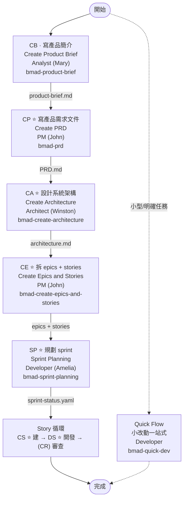
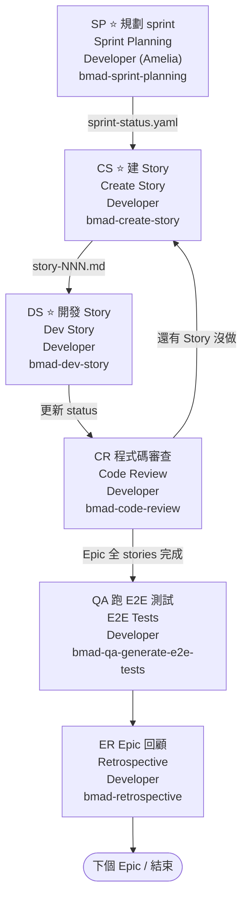

BMAD Method 把 agile lifecycle 切成 4 階段，每階段由特定 agent 主導。Quick Flow 是平行路徑，用 `bmad-quick-dev` 跳過 phase 1-3 處理小型、明確的任務。

> 指令名與 agent roster 以 **BMAD v6** 為準。v4 舊命名（如 `bmad-create-prd`、`bmad-create-ux-design`）在 v6 已縮短為 `bmad-prd`、`bmad-ux`；v4 的 Scrum Master「Bob」persona 在 v6 已併入新 roster，Sprint Planning / Create Story 改由 Amelia（Senior Engineer）負責。

## 必經 6 節點

| 代號 | 動作                   | Skill                           | 輸出 / 依賴                          |
| ---- | ---------------------- | ------------------------------- | ------------------------------------ |
| `CP` | Create PRD             | `bmad-prd`                      | 輸出 `PRD.md`                        |
| `CA` | Create Architecture    | `bmad-create-architecture`      | 輸出 `architecture.md`，需 PRD 就位  |
| `CE` | Create Epics & Stories | `bmad-create-epics-and-stories` | 輸出 epics / stories；需 PRD + Architecture 同時就位 |
| `SP` | Sprint Planning        | `bmad-sprint-planning`          | 輸出 `sprint-status.yaml`            |
| `CS` | Create Story           | `bmad-create-story`             | 每張 Story 起點，挑一張進入 dev      |
| `DS` | Dev Story              | `bmad-dev-story`                | 實作該 Story，更新 status            |

其他全部非必經。Quick Flow 用 `bmad-quick-dev` 一站到底，繞過全部。

## 關鍵規則

- **Fresh chats**：每個 workflow 開新 session，避免上下文污染
- **Architecture drives stories**：`CE` 必在 `CA` 之後
- **卡住先問 `bmad-help`**：智能導引、給「下一步」建議

## 整體流向

## Story 循環（階段 4）

## 階段 1 · 分析 (Analyst / Mary)

打底用，全選填；`CB` 強烈建議執行，後續 `CP` PRD 會比較準確。

| 代號 | 動作                      | Skill                     | 必填 | 備註                            |
| ---- | ------------------------- | ------------------------- | ---- | ------------------------------- |
| `BP` | Brainstorming             | `bmad-brainstorming`      | —    |                                 |
| `MR` | Market Research           | `bmad-market-research`    | —    |                                 |
| `DR` | Domain Research           | `bmad-domain-research`    | —    |                                 |
| `TR` | Technical Research        | `bmad-technical-research` | —    |                                 |
| `CB` | Create Product Brief      | `bmad-product-brief`      | 建議 | 後續 `CP` PRD 會更準確          |
| `WB` | PRFAQ / Working Backwards | `bmad-prfaq`              | —    | 用 Working Backwards 壓力測試概念 |

## 階段 2 · 規劃 (PM 為主)

| 代號 | 動作             | Agent       | Skill                   | 必填 | 備註                   |
| ---- | ---------------- | ----------- | ----------------------- | ---- | ---------------------- |
| `CP` | Create PRD       | PM          | `bmad-prd`              | ⭐   | 輸出 `PRD.md`          |
| `VP` | Validate PRD     | PM          | `bmad-validate-prd`     | —    |                        |
| `EP` | Edit PRD         | PM          | `bmad-edit-prd`         | —    | `VP` 後修訂            |
| `CU` | Create UX Design | UX-Designer | `bmad-ux`               | —    | Optional；有 UI 才需要 |

## 階段 3 · 方案設計

Architecture drives stories — `CE` 必在 `CA` 之後。

| 代號 | 動作                           | Agent          | Skill                                 | 必填 | 備註                              |
| ---- | ------------------------------ | -------------- | ------------------------------------- | ---- | --------------------------------- |
| `CA` | Create Architecture            | Architect      | `bmad-create-architecture`            | ⭐   | 輸出 `architecture.md`            |
| `CE` | Create Epics & Stories         | PM             | `bmad-create-epics-and-stories`       | ⭐   | 需 PRD + Architecture 同時就位    |
| `IR` | Check Implementation Readiness | PM / Architect | `bmad-check-implementation-readiness` | —    | Highly Recommended，cohesion 檢查 |

## 階段 4 · 實作 (Developer / Amelia 為主)

`SP` 後進 Story 循環，細節見上方「Story 循環」圖。

| 代號 | 動作               | Agent     | Skill                        | 必填 | 備註                                   |
| ---- | ------------------ | --------- | ---------------------------- | ---- | -------------------------------------- |
| `SP` | Sprint Planning    | Developer | `bmad-sprint-planning`       | ⭐   | 輸出 `sprint-status.yaml`              |
| `CS` | Create Story       | Developer | `bmad-create-story`          | ⭐   | 每張 Story 起點                        |
| `DS` | Dev Story          | Developer | `bmad-dev-story`             | ⭐   | 實作                                   |
| `CR` | Code Review        | Developer | `bmad-code-review`           | —    | 品質驗證                               |
| `QA` | QA E2E Tests       | Developer | `bmad-qa-generate-e2e-tests` | —    | Epic 全部 stories 完成並 review 後選跑 |
| `ER` | Epic Retrospective | Developer | `bmad-retrospective`         | —    | **Epic 完成後**才跑，非 per-story      |
| `QD` | Quick Dev          | Developer | `bmad-quick-dev`             | —    | bug fix / 小改動一站式                 |
| `CC` | Correct Course     | PM        | `bmad-correct-course`        | —    | 中途改 scope                           |

## Technical Writer (Paige)

獨立 agent，與四階段平行；任何階段需要寫文件時呼叫。

| 代號 | 動作             | 觸發類型       | 用途                       |
| ---- | ---------------- | -------------- | -------------------------- |
| `DP` | Document Project | workflow       | 對既有 codebase 產文件     |
| `WD` | Write Document   | conversational | 自訂文件撰寫               |
| `US` | Update Standards | conversational | 補充慣例 / standards       |
| `MG` | Mermaid Generate | conversational | 產 sequence / flowchart 等 |
| `VD` | Validate Doc     | conversational | 文件驗證                   |
| `EC` | Explain Concept  | conversational | 解釋概念                   |

## 相關

- [[bookmark-BMAD-Agent開發框架|BMAD]] — 框架定位與 12+ persona 介紹
