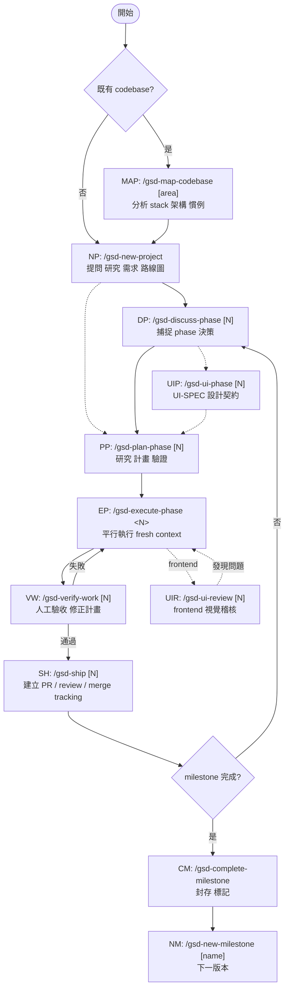

GSD（Get Shit Done）是輕量的 meta-prompting、context engineering、spec-driven development system，支援 Claude Code、OpenCode、Gemini CLI、Kilo、Codex、Copilot、Cursor、Windsurf 等 runtime。作者定位是把複雜度收進系統內部，對使用者暴露少量 commands，避免大型流程 ceremony。核心是把 AI coding 長任務拆成可驗證、可重開 fresh context 接力的階段，降低 context rot。

以下指令以 Claude Code / Copilot / OpenCode / Kilo 的 slash form 表示；Codex 實際語法是 `$gsd-*`，Gemini 是 `/gsd:*`。

## 核心流程節點

GSD 的 project / phase 主流程是六步：initialize → discuss → plan → execute → verify → ship。`MAP`、`UIP`、`UIR`、`progress`、milestone commands 是前置、選填、導覽或跨 milestone 節點，不屬於單一 phase 的必經核心迴圈。

| 代號 | 指令 | 動作 | 輸出 / 備註 |
| ---- | ---- | ---- | ----------- |
| `NP` | `/gsd-new-project` | 提問 → research → requirements → roadmap | `PROJECT.md`、`REQUIREMENTS.md`、`ROADMAP.md`、`STATE.md`、`config.json`、`research/`、`CLAUDE.md` |
| `DP` | `/gsd-discuss-phase [N]` | 捕捉 phase 實作決策與灰區；可跳過，跳過會採 reasonable defaults | `{phase}-CONTEXT.md`、`{phase}-DISCUSSION-LOG.md` |
| `PP` | `/gsd-plan-phase [N]` | research → plan → verify | `{phase}-RESEARCH.md`、`{phase}-{N}-PLAN.md`、`{phase}-VALIDATION.md` |
| `EP` | `/gsd-execute-phase <N>` | parallel waves 執行 plans；每個 executor 拿 fresh context | `{phase}-{N}-SUMMARY.md`、git commits；phase 完成後產生 `{phase}-VERIFICATION.md` |
| `VW` | `/gsd-verify-work [N]` | 人工 acceptance testing；失敗時自動診斷並產生 fix plan | `{phase}-UAT.md`、fix plans；有問題回到 `EP` |
| `SH` | `/gsd-ship [N]` | 已驗證 phase 建 PR；可觸發 review 並追蹤 merge | GitHub PR、`STATE.md` 更新 |

## 選填 / 輔助節點

| 代號 | 指令 | 動作 | 輸出 / 備註 |
| ---- | ---- | ---- | ----------- |
| `MAP` | `/gsd-map-codebase [area]` | brownfield 前置掃描 codebase；也可用 `--fast` 快速掃 | `.planning/codebase/` analysis docs；既有 codebase 通常先跑再 `NP` |
| `UIP` | `/gsd-ui-phase [N]` | frontend phase 的 UI 設計契約；通常插在 `DP` 與 `PP` 之間 | `{phase}-UI-SPEC.md` |
| `UIR` | `/gsd-ui-review [N]` | 已實作 frontend 的 retroactive 6-pillar 視覺稽核 | `{phase}-UI-REVIEW.md`、screenshots；可在 `SH` 前或事後補跑 |
| `PROG` | `/gsd-progress --next` | auto-detect 目前狀態並推進下一個合理 workflow step | 缺 project → 建議 `NP`；需討論 / 規劃 / 執行 / 驗收時路由到對應 command；全部完成才建議 `CM` |
| `CM` | `/gsd-complete-milestone` | milestone 完成後 archive / tag | `MILESTONES.md` entry、git tag；建議 milestone audit 後執行 |
| `NM` | `/gsd-new-milestone [name]` | 啟動下一版 | 更新 `PROJECT.md`、新 `REQUIREMENTS.md`、新 `ROADMAP.md` |

## 整體流向

虛線分支（`DP` skip、`UIP`、`UIR`）= 依情境選填；`PROG` 是狀態導覽工具，不是流程節點。

## 關鍵規則

- **Fresh context**：heavy work 交給新 subagent context，主對話維持乾淨，降低 context rot。
- **Structured artifacts**：用 `.planning/` 裡的 `PROJECT.md`、`REQUIREMENTS.md`、`ROADMAP.md`、`STATE.md`、`{phase}-CONTEXT.md` 保存跨 session 狀態。
- **Plan must pass verification**：`/gsd-plan-phase` 不是只產計畫，還會 research + plan + verify。
- **Execute in waves**：`/gsd-execute-phase` 平行執行可獨立 plans，任務以 atomic commit 收斂。
- **Verify before ship**：`/gsd-verify-work` 是人工驗收入口；失敗先診斷並產生 fix plan，再重跑 execute。
- **Repeat by phase**：主循環是 discuss → plan → execute → verify → ship。

## 相關

- [[GSD框架]] — GSD v1 / v2 定位與架構差異
- [[BMAD-Method-流程]] — 另一種較完整 ceremony 的 agentic agile workflow
- [gsd-build/get-shit-done](https://github.com/gsd-build/get-shit-done)
