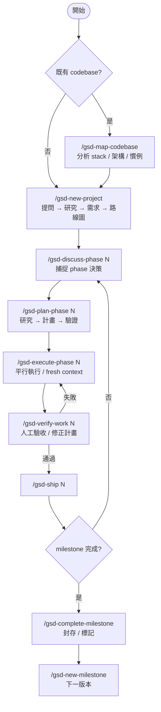

GSD（Get Shit Done）是輕量的 meta-prompting、context engineering、spec-driven development system，定位與 BMAD 類似但 ceremony 更少。核心是把 AI coding 長任務拆成可驗證、可重開 fresh context 接力的階段，避免 context rot。

## 核心節點

| 代號 | 指令 | 動作 | 輸出 / 備註 |
| ---- | ---- | ---- | ----------- |
| `MAP` | `/gsd-map-codebase` | 分析既有 codebase 的 stack / 架構 / conventions | 有既有 codebase 才需要；`NP` 前置步驟 |
| `NP` | `/gsd-new-project` | 提問 → research → requirements → roadmap | `PROJECT.md`、`REQUIREMENTS.md`、`ROADMAP.md` |
| `DP` | `/gsd-discuss-phase N` | 捕捉本 phase 的實作決策與灰區 | `CONTEXT.md` 更新 |
| `PP` | `/gsd-plan-phase N` | research → plan → verify | 小到可在 fresh context 執行的 plans |
| `EP` | `/gsd-execute-phase N` | parallel waves 執行，每個 executor 拿 fresh context | atomic commits |
| `VW` | `/gsd-verify-work N` | 人工 acceptance testing；失敗時診斷並產生 fix plan | fix plan → 重跑 `EP` |
| `SH` | `/gsd-ship N` | 已驗證 phase 建 PR / ship | phase closeout |
| `CM` | `/gsd-complete-milestone` | milestone 完成後 archive / tag | milestone 全部 phase 通過後才跑 |
| `NM` | `/gsd-new-milestone` | 啟動下一版本 | — |

## 整體流向

## 關鍵規則

- **Fresh context**：heavy work 交給新 subagent context，主對話維持乾淨，降低 context rot。
- **Structured artifacts**：用 `PROJECT.md`、`REQUIREMENTS.md`、`ROADMAP.md`、`STATE.md`、`CONTEXT.md` 保存跨 session 狀態。
- **Plan must pass verification**：`/gsd-plan-phase` 不是只產計畫，還會 research + plan + verify。
- **Execute in waves**：`/gsd-execute-phase` 平行執行可獨立 plans，任務以 atomic commit 收斂。
- **Verify before ship**：`/gsd-verify-work` 是人工驗收入口；失敗先診斷並產生 fix plan，再重跑 execute。
- **Repeat by phase**：主循環是 discuss → plan → execute → verify → ship。

## 相關

- [[GSD框架]] — GSD v1 / v2 定位與架構差異
- [[BMAD-Method-流程]] — 另一種較完整 ceremony 的 agentic agile workflow
- [gsd-build/get-shit-done](https://github.com/gsd-build/get-shit-done)
