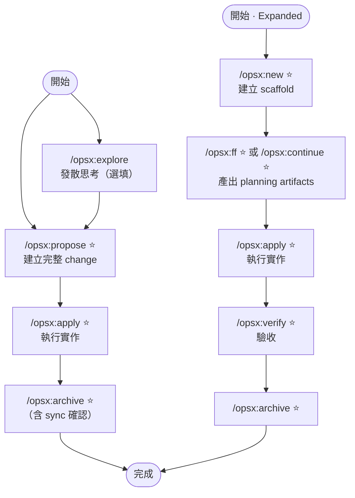
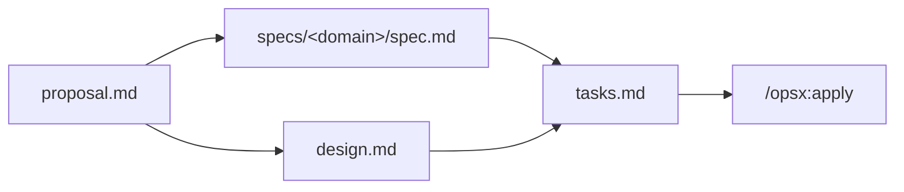

OpenSpec 是 Fission-AI 出品的輕量 spec 框架（npm）。OPSX 是目前的標準工作流，設計哲學是「Actions not phases」：artifact 之間有相依但沒有 phase gate，任何時候都可以回頭修改任何 artifact。支援 25+ AI coding agents。

## 核心節點

| 代號 | 指令 | Profile | 動作 | 輸出 / 備註 |
| ---- | ---- | ------- | ---- | ----------- |
| `EX` | `/opsx:explore` | core | 發散思考，釐清需求與選項 | 無固定輸出；propose 前用 |
| `PR` | `/opsx:propose` | core ⭐ | 一步建立完整 change | proposal + specs + design + tasks |
| `AP` | `/opsx:apply` | core ⭐ | 依 tasks.md 執行實作 | 過程可隨時更新 artifact |
| `SY` | `/opsx:sync` | core（v1.3.1 npm 未含） | 同步 delta specs 進主規格 | `archive` 執行時自動詢問是否 sync；npm 版本暫缺此 skill，可用 `archive` 代勞 |
| `AR` | `/opsx:archive` | core ⭐ | 合併 delta specs 並封存 change | change 移至 `changes/archive/`；含 sync 確認步驟 |
| `NW` | `/opsx:new` | expanded ⭐ | 建立 change scaffold（只搭架） | — |
| `CT` | `/opsx:continue` | expanded ⭐ | 依相依圖逐步建立下一個 artifact | 與 `FF` 擇一；每次一個 |
| `FF` | `/opsx:ff` | expanded ⭐ | 一次產出所有 planning artifacts | 與 `CT` 擇一；目標清楚時用 |
| `VF` | `/opsx:verify` | expanded ⭐ | 對照 specs 驗收實作 | — |
| `BA` | `/opsx:bulk-archive` | expanded | 批次封存多個 changes | — |
| `ON` | `/opsx:onboard` | expanded | 引導走完整一次 OPSX 流程（end-to-end walkthrough） | — |

Expanded profile 需 `openspec config profile` 啟用，再跑 `openspec update`。

## 整體流向

## Artifact 相依圖

specs 與 design 平行產出（都只依賴 proposal），tasks 需兩者完成才能建立：

## 關鍵規則

- **Actions not phases**：沒有強制 phase gate，`AP` 中發現設計錯誤直接改 design.md 再繼續
- **EX before PR**：idea 模糊先跑 `EX`；目標清楚直接跑 `PR`
- **FF vs CT**：知道要做什麼用 `FF` 一次產出；還在探索用 `CT` 逐步推進
- **Delta not full rewrite**：specs 只記「這次改了什麼」（ADDED / MODIFIED / REMOVED），`archive` 時合併進主規格；`sync` 在 v1.3.1 npm 版本未發佈，由 `archive` 內建的確認步驟代勞
- **Update vs New change**：同目標、微調執行 → 更新既有 change；意圖根本改變或 scope 爆增 → 開新 change

## 相關

- [[Spec-Kit-流程]] — 類似 SDD 工具，GitHub 出品，phase 更嚴格
- [Fission-AI/OpenSpec](https://github.com/Fission-AI/OpenSpec)

## 版本備註

- 安裝：`npm install -g @fission-ai/openspec`（最新 v1.3.1）
- `/opsx:sync` 在 GitHub 文件中屬 core，但 v1.3.1 npm 版本尚未發佈；`openspec config list` 可驗證
- Core profile 實際 4 個 skill：`explore` / `propose` / `apply` / `archive`