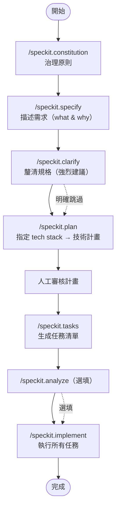

Spec Kit 是 GitHub 出品的 Spec-Driven Development（SDD）工具組。核心哲學：先寫可執行規格，再產出實作，而非先碼後補文件。支援 30+ AI coding agents。

## 指令一覽

| 代號 | 指令 | 必填 | 動作 |
| ---- | ---- | ---- | ---- |
| `CO` | `/speckit.constitution` | ⭐ | 建立專案治理原則 |
| `SP` | `/speckit.specify` | ⭐ | 描述要做什麼（what & why，不談 tech stack） |
| `CL` | `/speckit.clarify` | — | 結構化釐清規格灰區（PL 前強烈建議） |
| `PL` | `/speckit.plan` | ⭐ | 給定 tech stack → 生成技術實作計畫 |
| `CH` | `/speckit.checklist` | — | 生成自訂品質清單，驗需求完整性與一致性 |
| `TK` | `/speckit.tasks` | ⭐ | 生成任務清單（含相依排序與平行標記 `[P]`） |
| `AN` | `/speckit.analyze` | — | 跨 artifact 一致性與覆蓋分析（TK 後、IM 前） |
| `TI` | `/speckit.taskstoissues` | — | 把 tasks.md 轉為 GitHub Issues |
| `IM` | `/speckit.implement` | ⭐ | 執行所有任務 |

## 整體流向

## 關鍵規則

- **Spec first**：`SP` 只描述 what & why，tech stack 留到 `PL` 才給
- **Clarify before plan**：`CL` 在 `PL` 前跑，明確跳過需向 agent 陳述意圖
- **Validate before implement**：`PL` 後人工審核計畫再跑 `TK`，避免過度設計
- **Constitution 是地基**：`CO` 的治理原則貫穿所有後續階段

## 相關

- [[GSD-流程]] — 類似輕量 spec-driven workflow，ceremony 更少
- [[BMAD-Method-流程]] — agentic agile workflow，phase 更完整
- [github/spec-kit](https://github.com/github/spec-kit)
