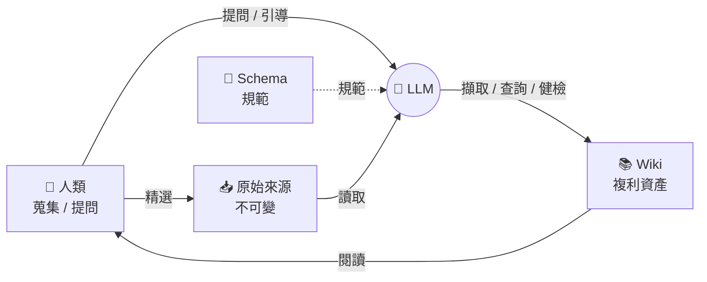

Karpathy 提出的個人知識庫模式：不靠 RAG 即時擷取，而是讓 LLM 漸進式建立並維護一個持久、互聯的 markdown wiki，夾在你與原始資料之間。本 vault 自身就是這套模式的實作，這篇是它的方法論原典與出處。

## 與 RAG 的根本差異

RAG 每次查詢都從原始文件重新擷取、重新拼湊——什麼都不累積，問一個需要綜合五份文件的問題，每次都得重找。

LLM Wiki 相反：知識被**編譯一次後持續維護**。交叉引用已建好、矛盾已標記、綜合分析已反映讀過的所有內容。**wiki 是複利資產**——每加一個來源、每問一個問題都讓它更豐富。

判準：知識要不要跨時間累積、要不要互聯成網 → 用 Wiki；只是一次性問答檢索 → RAG 就夠。

## 三層架構

原文是**三層**，不是四層（坊間「raw/wiki/index/log 四層」把 wiki 內的特殊檔案誤升成獨立層）：

1. **Raw sources（原始來源）** — 你精選的來源，不可變。LLM 只讀不改，是事實來源。
2. **Wiki** — LLM 生成與維護的 markdown：摘要、條目、概念、比較、綜合。完全由 LLM 掌管，你只負責讀。
3. **Schema** — 規範文件（`CLAUDE.md` / `AGENTS.md`），告訴 LLM wiki 的結構、慣例與工作流程。這是把 LLM 從通用聊天機器人變成「有紀律的 wiki 維護者」的關鍵。

`index.md`（內容導向目錄）與 `log.md`（時序僅追加紀錄）是 **wiki 層內的兩個特殊檔案**，不是獨立層級。

## 標準化方向：OKF

Google Open Knowledge Format（OKF）可視為 LLM Wiki 的標準化方向：用每層 `index.md`、concept metadata、YAML description 讓 agent 先判斷「這份知識庫有什麼、哪個檔案值得打開」，再精準讀內容。它不是取代 wiki，而是把每個人自訂的 second brain 慣例整理成較可攜、可分享、可被 agent 導航的 bundle。

對本 vault 的啟發不是追著格式改名，而是保留現有 `vault-map.md` / `topics/*/index.md` 這類入口的價值：agent 先讀索引與描述，再進細節，比直接全文 grep 更省 token，也更不容易重複建頁或放錯位置。OKF 仍偏新，實務上先學它的「索引 + 單一概念 + metadata」原則，不急著把 vault 轉成另一套格式。

## 三個日常動作

- **Ingest（擷取）** — 加入新來源 → LLM 讀 → 與你討論重點 → 寫摘要頁、更新 index、更新相關條目/概念頁、log 記一筆。單一來源可牽動 10–15 頁。
- **Query（查詢）** — 向 wiki 提問，LLM 讀 index → 找頁 → 綜合附引用的答案。**關鍵：好答案應回存成新頁**，讓探索跟來源一樣複利累積。
- **Lint（健檢）** — 定期掃矛盾、過時主張、孤立頁、缺專屬頁的概念、缺交叉引用、資料空缺，產出修補與新探究建議。

## 為什麼有效

知識庫繁瑣的不是讀或想，是**書目整理**——更新交叉引用、保持摘要最新、維護數十頁一致。人類放棄 wiki 是因為維護負擔長得比價值快。LLM 不會無聊、不會忘記更新、可一次動 15 個檔案，**維護成本趨近於零**，所以 wiki 得以持續存活。

分工：人類蒐集來源、引導分析、提好問題、判斷意義；LLM 包辦其餘。

## 反指標：結構化垃圾場

若 AI 生成了一堆精美 wiki，但你**從不讀、不拿來決策**，再精緻也只是「結構化垃圾場」。Wiki 的價值在被人消化與使用，不在生成量——這也是本 vault「已內化才升 Card」原則的根據。

## 淵源

精神上承接 Vannevar Bush 1945 年的 **Memex**：私人、主動策管、文件間的聯想路徑與文件本身同等重要。Bush 無法解決「誰來做維護」——LLM 解決了。

## 來源

- [Karpathy LLM Wiki](https://gist.github.com/karpathy/442a6bf555914893e9891c11519de94f)
- [Google OKF 知識庫標準化解讀（AI Labs）](https://www.youtube.com/watch?v=k4sMSsMzX2g)
