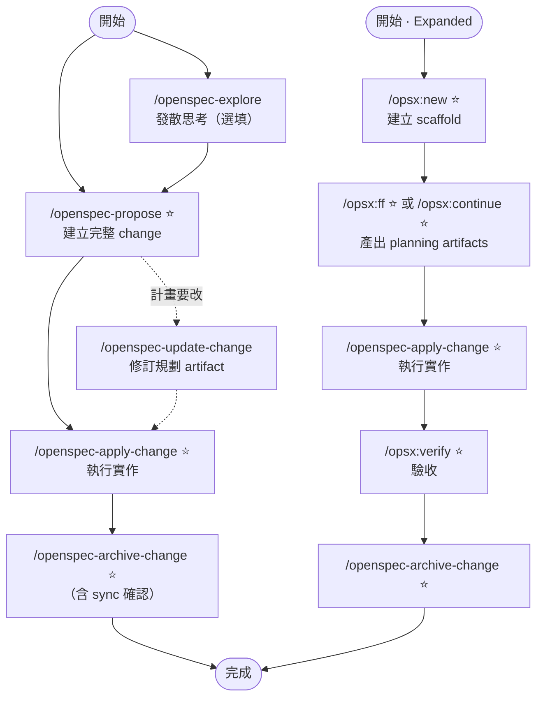
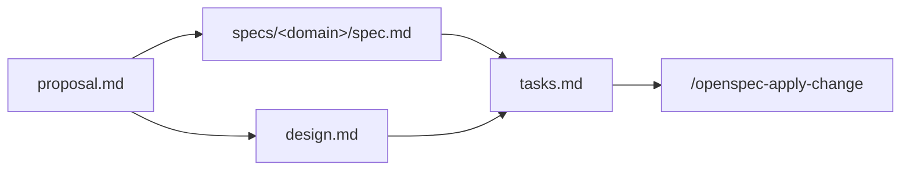

OpenSpec 是 Fission-AI 出品的輕量 spec 框架（npm）。OPSX 是目前的標準工作流，設計哲學是「Actions not phases」：artifact 之間有相依但沒有 phase gate，任何時候都可以回頭修改任何 artifact。支援 34 個 AI coding agent（2026-07-21 清點官方 `docs/supported-tools.md` 表格；官方摘要句寫 25+／30+ 不一致，以表格逐列為準）。

## 核心節點

> **命令命名**：core 6 個都有本機 skills delivery 實際名稱（`/openspec-*`）。expanded 那批（custom profile）本機無對應 skill，保留官方文件的 `/opsx:*` 字面；啟用後實際名稱依該 host 的 delivery 而定。

| 代號   | 指令                     | Profile             | 動作                                      | 輸出 / 備註                                                  |
| ---- | ---------------------- | ------------------- | --------------------------------------- | -------------------------------------------------------- |
| `EX` | `/openspec-explore`      | core                | 發散思考，釐清需求與選項                            | 無固定輸出；propose 前用                                         |
| `PR` | `/openspec-propose`      | core ⭐              | 一步建立完整 change                           | proposal + specs + design + tasks                        |
| `AP` | `/openspec-apply-change` | core ⭐              | 依 tasks.md 執行實作                         | 過程可隨時更新 artifact                                         |
| `UP` | `/openspec-update-change` | core               | 就地修訂既有 change 的規劃 artifact 並保持一致        | 只碰規劃層：不改程式碼、不補建缺漏 artifact（那是 `CT`）；每筆編輯先確認 |
| `SY` | `/openspec-sync-specs`   | core                | 同步 delta specs 進主規格                     | 可獨立跑；`archive` 執行時也會詢問是否 sync                 |
| `AR` | `/openspec-archive-change` | core ⭐            | 合併 delta specs 並封存 change               | change 移至 `changes/archive/`；含 sync 確認步驟                 |
| `NW` | `/opsx:new`              | expanded ⭐          | 建立 change scaffold（只搭架）                 | 本機無對應 skill                                              |
| `CT` | `/opsx:continue`         | expanded ⭐          | 依相依圖逐步建立下一個 artifact                    | 與 `FF` 擇一；每次一個                                           |
| `FF` | `/opsx:ff`               | expanded ⭐          | 一次產出所有 planning artifacts               | 與 `CT` 擇一；目標清楚時用                                         |
| `VF` | `/opsx:verify`           | expanded ⭐          | 對照 specs 驗收實作                           | —                                                        |
| `BA` | `/opsx:bulk-archive`     | expanded            | 批次封存多個 changes                          | —                                                        |
| `ON` | `/opsx:onboard`          | expanded            | 引導走完整一次 OPSX 流程（end-to-end walkthrough） | —                                                        |

Expanded profile 需 `openspec config profile` 啟用，再跑 `openspec update`。

## 整體流向

## Artifact 相依圖

specs 與 design 平行產出（都只依賴 proposal），tasks 需兩者完成才能建立：

## 關鍵規則

- **Actions not phases**：沒有強制 phase gate，`AP` 中發現設計錯誤直接改 design.md 再繼續
- **EX before PR**：idea 模糊先跑 `EX`；目標清楚直接跑 `PR`
- **FF vs CT**：知道要做什麼用 `FF` 一次產出；還在探索用 `CT` 逐步推進
- **Delta not full rewrite**：specs 只記「這次改了什麼」（ADDED / MODIFIED / REMOVED），`archive` 時合併進主規格；`sync` 可獨立跑，不跑也行——`archive` 內建的確認步驟會問你要不要先 sync
- **Update vs New change**：同目標、微調執行 → 更新既有 change（用 `UP`）；意圖根本改變或 scope 爆增 → 開新 change
- **⚠️ 別真的跳過 design**：官方文件說 design 可選，但出貨的 spec-driven schema 裡 `tasks` 的 `requires` 是 `[specs, design]`，graph 引擎無 optional 機制。實測缺 `design.md` 時 `openspec status` 會回報 `tasks (blocked by: design)`，卡住不動。`PR` 預設會一起生成所以平常撞不到；真要跳過得自訂 schema 改掉 `tasks` 的 requires（2026-07-21 實測 1.6.0）

## 相關

- [[確認-OpenSpec-狀態]] — specs/changes 狀態確認指令分工與 `requirements 0` parser 除錯
- [[Spec-Kit-流程]] — 類似 SDD 工具，GitHub 出品，phase 更嚴格
- [Fission-AI/OpenSpec](https://github.com/Fission-AI/OpenSpec)

## 版本備註

- 安裝：`npm install -g @fission-ai/openspec`（版本見官方 releases）
- **Core profile 為 6 個 workflow**（原始碼 `src/core/profiles.ts` 的 `CORE_WORKFLOWS`）：`propose` / `explore` / `apply` / `update` / `sync` / `archive`。skills delivery 下的目錄名依序為 `openspec-propose`、`openspec-explore`、`openspec-apply-change`、`openspec-update-change`、`openspec-sync-specs`、`openspec-archive-change`
- **舊記錄的兩處已失效**（2026-07-21 對 1.6.0 修正）：① 「`sync` 不在 core 交付」自 1.4.0 起不成立——changelog 明載新安裝在 core profile 直接生成 `/opsx:sync`；② 「core 實際 4 個 skill」漏了後來加入的 `sync` 與 `update`（`update` 為 1.6.0 新增）