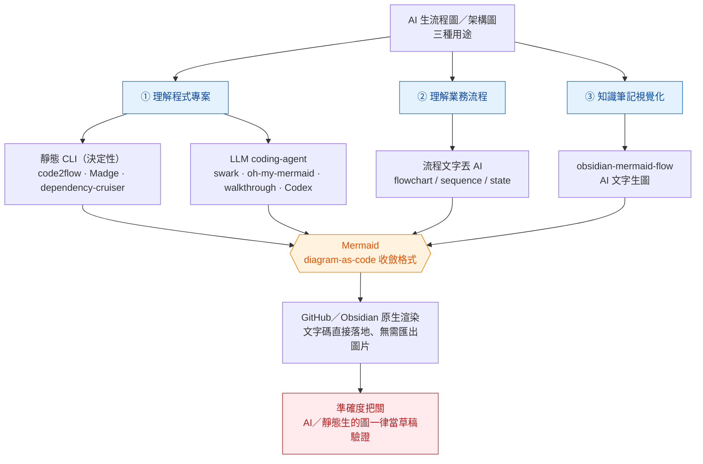

讓 AI 生流程圖／架構圖來加速理解**程式專案、業務流程、知識筆記**三種用途，選型收斂到三個層次；關鍵洞察是它們幾乎全部吐同一種格式——**Mermaid（diagram-as-code，文字轉圖）**，而 Obsidian 與 GitHub 都原生渲染 Mermaid，AI 產出的文字碼可直接落地、無需匯出圖片。

> 本頁為 2026-07-16 deep-research 回存（26 來源 → 123 主張 → 對抗查證 25 條，23 確認、2 否決）。每條主張就地標**證據強度**；被否決主張列於「六、勿引用」節。

全景：三用途各有生圖路徑，幾乎全部收斂到 Mermaid，經 GitHub／Obsidian 原生渲染後仍需人眼把關（本圖本身即以 Mermaid 文字碼直接落地、無匯出圖片，自我印證此收斂）。



## 一、逆向掃 codebase 生架構圖（理解程式專案）

兩條成熟路線並存，皆高信心（工具官方 repo/docs 逐字確認）：

**A. 靜態分析 CLI（無 AI、決定性）**

- `code2flow`：掃原始碼經 AST 生**呼叫圖**（call graph），輸出 Graphviz png/svg/dot；定位新人 onboarding、釐清 spaghetti code、找孤立函式。
- `Madge`：JS/TS **依賴圖** SVG/DOT，`--circular` 偵測循環依賴。
- `dependency-cruiser`：依賴圖，可在 CI 用 `severity:error`＋非零 exit code **強制依賴規則**（守門違規依賴）。

**B. LLM coding-agent 整合（幾乎全數輸出 Mermaid）**

- `swark`（VS Code 擴充）：走 GitHub Copilot LLM 生 Mermaid 架構圖，**免 API key、Copilot 免費層可用＝零額外成本**（但受額度上限）。
- `oh-my-mermaid`（Claude Code）：`/omm-scan` 生 structure／data-flow／integrations **多視角** Mermaid。
- `walkthrough` skill（Claude Code）：自然語言觸發、平行 subagent 探索、生**可點擊 HTML＋Mermaid** 走查。
- `@mermaid-chart`（GitHub Copilot participant）：對 `#file`／`#selection` 生 flowchart/class diagram，可在 Mermaid 編輯器續改。
- Codex CLI：讀 compose/k8s/IaC/OpenAPI/import graph 生 Mermaid/PlantUML/C4。

## 二、產出語法選型：Mermaid 是預設贏家

高信心（比較表逐字＋GitHub 官方 blog 佐證）：

| | Mermaid | PlantUML | Draw.io |
|---|---|---|---|
| 輸入模式 | 文字轉圖 | 文字轉圖 | 視覺拖拉、無需語法 |
| 學習曲線 | **低** | 中高（需 Java 生態） | 低 |
| AI 支援 | **Excellent**（比較表中唯一） | Good | Good |
| 原生渲染面 | **最廣**：GitHub、GitLab、Notion、Obsidian | GitHub 需外部 proxy/預生圖 | 嵌圖非文字渲染 |
| 最適場景 | Docs/GitHub/code review、Markdown 快速文件 | 需精確控制的複雜 UML | 非技術成員協作 |

GitHub 自 **2022-02** 起原生渲染 Mermaid（涵蓋 README/issue/PR/comment/wiki，官方 blog 確認）。另有 Excalidraw（手繪白板草圖）、Lucidchart（付費團隊協作）補位。

> 版本註：Mermaid「modern syntax」隨版本演進，確切語法變更以官方 changelog 為準；此處只留「LLM 常吐舊語法」這個行為約束（見「五、準確度與 prompt 減錯」）。

## 三、Obsidian 端（知識筆記視覺化）

高信心（Obsidian 官方 help＋外掛 README 逐字）：

- **Mermaid 免外掛**，reading view 與 live preview **皆原生渲染**（僅特定複雜圖有 edge-case bug）。
- 想擺脫手寫語法：`obsidian-mermaid-flow` 這類 **WYSIWYG 拖拉編輯器**——在 SVG 畫布移動節點/連線/縮放/多選，**自動寫回 Mermaid code**；並自帶可選 **AI 文字生圖**（自帶 OpenAI/Gemini/Anthropic/Local CLI provider）。

## 四、接進本 vault 的工作流

**可複用 5 步 SOP（中等信心，來自單一 tutorial repo，非實證研究）**：Clarify（釐清範圍）→ Select（選工具與圖型）→ Generate（生 diagram-as-code）→ Present（呈現）→ Iterate（迭代修正）。

貼合本 vault（Obsidian ＋ Claude Code）的三條固化管道，對應開頭三用途：

1. **理解程式專案**：Claude Code 內用 `oh-my-mermaid` 或 `walkthrough` skill 掃 codebase → 生多視角 Mermaid → 貼進該專案 wiki/README；快速釐清依賴則用 `Madge`/`dependency-cruiser`（可掛 CI 守門）。
2. **理解業務流程**：把 SOP/決策邏輯文字丟 AI，要它產 Mermaid `flowchart`/`sequenceDiagram`/`stateDiagram` → 貼進 Obsidian 原生渲染。
3. **知識筆記視覺化**：vault 內用 `obsidian-mermaid-flow` 的 AI assist 從文字 prompt 生概念關係圖，或手動微調。

**呈現與討論：mermaid.live 連結（此做法已於 2026-08-06 撤銷）**

⚠️ **使用者於 2026-08-06 表態往後不再使用 Mermaid**——含 mermaid 語法、` ```mermaid ` fenced block 與 mermaid.live 連結，已寫入全域規則。下段描述的固化做法連同 5 步 SOP 的 Present→Iterate 兩步一併退場；現行做法改為寫成可獨立開啟的本地 HTML，或在文字足夠表達時直接用箭頭／縮排清單呈現。原文保留於下，供理解該做法當初為何成立。


上述管道**生出圖之後、還沒定稿落地時**，要先看渲染結果來討論——典型情境是**使用者要一張架構圖，agent 先生一版範例供討論迭代**——就用官方線上編輯器 [mermaid.live](https://mermaid.live) 呈現：它把整張圖的 state 以 pako（deflate＋base64）編進 URL fragment，連結**自包含、無需伺服器儲存、也無需本機 render 或匯出圖片**，貼 `mermaid.live/view#pako:…` 對方點開即見渲染（`view` 純檢視、`edit` 可續改）。這正落在 5 步 SOP 的 **Present（呈現）→ Iterate（迭代）**：生圖 → 貼連結看範例 → 據此討論修改 → 定稿後才用 `mermaid` fenced code block 落地進 Obsidian／GitHub 原生渲染（本頁開頭全景圖即走完此流程的成品）。此「做法」本身屬本 vault 實踐約定、非查證主張；mermaid.live **工具本身**的可用性與限制見下方 2026-07-17 deep-research 查證。

下方的 mermaid.live 工具查證**仍保留**：它記錄的是工具事實（pako fragment 不上伺服器、可自架、官方站辨識），與本 vault 用不用它無關，日後評估同類線上編輯器仍可回查。

**mermaid.live 可用性與限制（2026-07-17 deep-research 回存：5 搜尋角度、7 主張對抗查證——6 確認（含 1 條中信心）、1 條否決）**

- **可正常使用（高信心，官方 repo＋官網交叉確認）**：mermaid-js 官方團隊維護的 Live Editor，開源 **MIT**、**免費**、基本使用**免註冊登入**；官網 mermaid.js.org 首頁「Open Editor」直連，issue tracker 活躍至 2026-05。
- **隱私＝這條做法的關鍵利多（高信心，官方原始碼 `serde.ts`＋維護者 discussion 確認）**：pako 把整張圖壓縮後編進 URL 的 **fragment（`#` 之後）**，依 HTTP 規範 **fragment 不送伺服器**、圖在瀏覽器本地渲染——貼 `view#pako:`／`edit#pako:` 連結時**圖內容不落任何遠端伺服器**，含專案內部資訊的架構圖可安心分享。**唯一外洩例外**：主動選「存成 GitHub gist」會落到 GitHub 基礎設施，敏感內容勿用此選項。
- **主要限制＝URL 長度（中信心，官方 issue #52/#439/#1348 承認；長度數字部分為單一 blog，取保守值）**：整張圖編進 URL，**複雜大圖產生超長連結而失效**，實務安全門檻約 **2000 字元**（瓶頸多在中途 CDN/proxy 或聊天平台截斷，非瀏覽器本身——現代瀏覽器可承受 32K–64K+）。超限時改用 `mermaid` fenced code block 貼進 Obsidian／GitHub 原生渲染。
- **可離線／自架（高信心）**：官方 Docker 映像 `ghcr.io/mermaid-js/mermaid-live-editor`，本質純靜態 SPA，核心作圖與渲染 100% client-side（PNG/SVG 匯出預設打 mermaid.ink，可用 `MERMAID_RENDERER_URL` 改指自架 renderer）。
- **免費／付費界線（高信心）**：即時協作與版本歷史屬付費 **Mermaid Chart**（同團隊 SaaS），不在免費 Live Editor；免費作圖＋pako 分享已足本 vault 用途。
- **⚠️ 認站（高信心）**：官方唯一為 **mermaid.live**（對應 repo `mermaid-js/mermaid-live-editor`）；`mermaidonline.org`、`mermaideditor.com` 等為**非官方第三方 clone**，其隱私政策不適用官方站。
- **❌ 勿引用（本輪對抗查證否決 1-2）**：「Mermaid 不存在付費層」——核心函式庫確為 MIT 開源，但生態**有**付費 Mermaid Chart，兩者須分清。

把生圖接進 vault/coding agent 的實作層，與 [[第二大腦整合的現成工具與做法]]（obsidian-claude-code-mcp、Quartz Syncer 等）同屬「餵知識給 agent、把產物落回 vault」的管道家族；本頁補足其中「生圖」這條。反方向的載體問題見 [[WSL-剪貼簿貼圖到-Claude-Code]]：本頁處理「怎麼把圖給人看」（呈現載體現行為本地 HTML，mermaid.live 固化做法已於 2026-08-06 撤銷，見上節），該頁處理「怎麼把圖給 agent 看」——WSL2 上手動 `Ctrl+V`／`Alt+V` 貼圖這條路徑會因剪貼簿解碼層只給 `image/bmp` 而無聲斷掉（給檔案路徑不受影響）。

## 五、準確度與 prompt 減錯（生成物一律驗證）

> ⚠️ **準確度警訊（高信心，工具自陳非行銷語）**：靜態分析工具坦承「無法對動態語言產生完美呼叫圖」（code2flow README 列出 function factory、namespace collision、renamed/imported 函式等失敗模式），且**只反映「設計的架構」而非執行期真實行為**（Codex CLI 亦明列 "Static analysis only, no runtime observation"）。**AI／靜態生的圖一律當草稿驗證，不當事實。** 此懷疑論與 [[AI-自主工作流的實證檢驗]] 對 benchmark 高估、驗證迴路必要性的收斂主軸同源——生成物需人眼把關。同一「生成物需外部判準」原則在設計領域的並行落地見 [[設計品質的可量化檢測]]（眼動／WCAG／CSS 統計四項外部 evaluator）。

**避免 AI 生圖出錯的 prompt 技法**：

- ✅ **已實證**：用 `#file`／`#selection` 指定範圍、縮小上下文以減錯（@mermaid-chart，本輪唯一經對抗查證的減錯手法）。
- ⚠️ **低強度（blog 級、未經本輪查證，當經驗法則）**：明確鎖定 diagram type 再描述內容（`Output ONLY valid Mermaid code, no explanation. Create a [type] for [desc]`）；要求 `use modern Mermaid syntax`（避免 LLM 吐舊訓練資料的 legacy 語法）；節點多時先讓 AI 列元件清單、再連線，分段生成。

## 六、勿引用（本輪對抗查證否決，各 0-3）

- ❌ **D2 以「原生 GitHub 渲染」為賣點** — D2 在 GitHub 無原生渲染。
- ❌ **CodeSee 自動生可編輯的 repo 結構圖並整合進 PR review** — 否決。

## 尚待釐清

1. 避免 AI 生圖出錯的具體 prompt 技法缺乏實證來源（僅 #file/#selection 一項確認）。
2. 逆向生圖工具在大型/多語言 monorepo 的實際準確率與 token 成本無獨立 benchmark（各工具僅自陳限制）。**⚠️ 2026-08-10 部分補上**：call graph 這一段已有第三方量化實證，見 [[不讀碼時該看哪些圖]]——ICSE 2020 對 31 個 Java 程式實測靜態 call graph 中位 recall 僅 0.884，ISSTA 2024 在 1000 個 Android app 上測 13 個工具平均漏 61%，且漏因主要是 native 配置與框架/JVM 主動發起、程式中無對應 call site 的呼叫（非反射），換工具補不上。這把上方「無法對動態語言產生完美呼叫圖」的**工具自陳**升級為獨立量測。**仍未解**：token 成本、多語言 monorepo 情境，以及本節談的 LLM 生圖路線（swark／oh-my-mermaid 等）本身仍無任何獨立準確率評測——上述兩篇測的是傳統靜態分析，不是 LLM 生圖。
3. 把 AI 生圖固化進 vault 日常（自動為 wiki 概念頁生關係圖並串既有 Mermaid 原生渲染）**無現成方案，需自建**。
4. 「業務流程文字轉圖」相較 codebase 逆向生圖**缺乏專屬工具**——多數工具聚焦程式碼。
5. mermaid.live 超長 pako 連結的**實務可靠字元上限、與圖節點數的大致換算**未有定論（2000 字元為保守值，真正瓶頸常在中途 CDN/proxy 而非瀏覽器）；`view` 與 `edit` 模式除唯讀／可編輯外的行為差異亦未實測。

## 關聯

- [[架構圖框架採用現況與-AI-時代轉向]] — 補上本頁「無獨立 benchmark」缺口的另一半：ArchAgent（arXiv 2601.13007）在 8 個 1k–22k 檔的 production 專案上做**架構恢復**評測，元素層級 F1 0.966 對 DeepWiki 0.860（p=0.0036、30 位資深工程師人工核對）——這是本頁工具類別目前最硬的量化數字，但 ground truth 是「與人寫的架構文件多像」而非執行行為，且論文無 Limitations 章節。該頁另記本頁選型直接相關的生態變動：C4 專用工具鏈 structurizr cli／java／lite 已於 2026-02-01 全數封存，而 C4 語法反被 Mermaid 吸收（仍標 experimental、跑 legacy renderer）。
- [[不讀碼時該看哪些圖]] — 本頁的**選層對照**：本頁答「用什麼工具生圖、產出什麼語法」，該頁答「該生哪一層、哪一層根本不該生」。兩者在準確度上收斂到同一結論但強度不同——本頁是工具自陳的警訊，該頁補上第三方量化實證，並據此把「自動產的呼叫圖」降級為只能探索、不能當依據。該頁另給出本頁沒有的落地面：從 DB metadata（而非原始碼）反向產 ER 圖這條不受靜態分析限制的路線，以及 `tbls doc` → CI `tbls diff` 的防過期循環。

## 時效提醒

AI coding-agent 生圖生態變動極快（swark、oh-my-mermaid、walkthrough 皆 2024–2025 新興 repo/skill），功能與 star 數會快速變動；swark「零成本」僅在 Copilot 免費額度內成立。逆向工具與 Obsidian 外掛的功能宣稱多為各自 repo README（primary 但屬自陳），適合「工具有什麼功能」、非獨立效能背書。mermaid.live 的授權（MIT）與架構（pako fragment 不上伺服器、靜態 SPA）屬穩定事實，但免費／付費界線與 issue 數屬可能隨版本變動的浮動事實，確切以官方為準。
