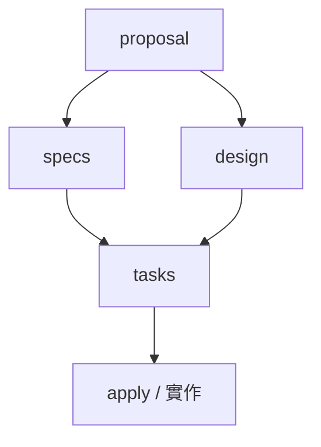

# OpenSpec

[Fission-AI 的 OpenSpec](https://github.com/Fission-AI/OpenSpec) 是一套輕量的 **spec 層工具**，核心主張是**在寫任何程式碼前，先讓開發者與 AI coding agent 就「要建什麼」達成共識**（README 原話：*"agree on what to build before any code is written"*）。它不是 RAG、不是重型流程框架，而是把「規格」變成一組 checked-in 的 markdown，夾在你與 AI 之間當作實作契約。

在 [[AI-自主工作流的實證檢驗]] 的 spec-driven 光譜裡，OpenSpec 定位為 **Spec Kit 的輕量替代**——比 Spec Kit 的七步（`constitution → specify → clarify → plan → tasks → analyze → implement`）精簡，也比 BMAD 的多角色鏈輕。**注意該頁的核心結論**：整個 SDD 領域「流程描述清楚，但『這樣做讓 agent 做得更好』幾乎沒有夠格的獨立效果證據」——OpenSpec 的**流程可信、效果未經實證**，採用前請把它當「協作結構」而非「已證明的提效方案」。

本頁基礎內容來自 deep-research（2026-07-16，5 路平行搜尋＋每條主張 3 票對抗式查證）。除另註明外，各條皆 **3-0 通過驗證、強度 high**，且來自一手來源（官方 GitHub docs 的 main 分支、openspec.dev、npm registry）。

**2026-07-21 更新**：依官方 [opsx.md](https://github.com/Fission-AI/OpenSpec/blob/main/docs/opsx.md)（已落地 [[OpenSpec-OPSX-Workflow]]）、[CHANGELOG](https://github.com/Fission-AI/OpenSpec/blob/main/CHANGELOG.md) 與 npm registry 重寫工作流、設定與 schema 三節。**強度說明**：這輪是一手官方文件的直讀比對，**未再跑對抗式多票查證**；官方文件對自家行為的描述可信度高（強度 high），但「這樣做讓 agent 做得更好」的效果宣稱仍**無獨立證據**，前述警告不變。

## 版本現況（2026-07-21，high）

npm `@fission-ai/openspec` 最新為 **1.6.0**（2026-07-10 發佈）。**本頁早期內容寫於 0.x 時代，1.x 後最重要的變化是 OPSX 從實驗選項變成標準工作流**，舊的 `/openspec:*` 指令降級為 legacy 對照組。版本號會續動，具體以官方 changelog 為準。

## 安裝與初始化（high）

前置需求：**Node.js 20.19.0+**（行為關鍵門檻，故保留版本號；其餘版本以官方 changelog 為準）。

```bash
# 全域安裝（官方主推）
npm install -g @fission-ai/openspec@latest

# 其他套件管理器（bun 仍需 Node.js 20.19+ 在 PATH）
pnpm add -g @fission-ai/openspec@latest
yarn global add @fission-ai/openspec@latest
bun add -g @fission-ai/openspec@latest

# 免安裝
npx openspec@latest --version
nix run github:Fission-AI/OpenSpec -- init   # NixOS

# 在專案內初始化：建立 openspec/ 目錄並自動為所選 AI 工具寫整合檔
cd your-project && openspec init

# 驗證與升級
openspec --version
openspec update            # 升級 CLI 後刷新產生的整合檔
```

來源：官方 [README](https://github.com/Fission-AI/OpenSpec)、[installation.md](https://github.com/Fission-AI/OpenSpec/blob/main/docs/installation.md)、[getting-started.md](https://github.com/Fission-AI/OpenSpec/blob/main/docs/getting-started.md)、[openspec.dev](https://openspec.dev/)、npm registry — 六個來源逐字一致。

## 目錄結構（high）

```
openspec/
├── specs/                    # 現行行為的真實來源（source of truth）
│   ├── auth-login/           # 一個 capability 一個資料夾
│   │   └── spec.md
│   └── checkout-cart/
│       └── spec.md
├── changes/                  # 提案中的變更（每個變更一資料夾）
│   ├── <change-name>/
│   │   ├── proposal.md       # 為何做、做什麼
│   │   ├── specs/            # delta spec（ADDED/MODIFIED/REMOVED）
│   │   ├── design.md         # 設計決策（可選）
│   │   └── tasks.md          # 可獨立驗證的實作步驟
│   └── archive/              # 已完成變更（巢狀於 changes/ 內）
└── config.yaml               # 專案設定（可選）
```

**常見誤述（勿引用）**：網路上流傳「`archive/` 與 `changes/`、`specs/` 三者平行」的結構——此版本在對抗驗證中被 **0-3 否決**。正典為 **`archive/` 巢狀在 `changes/` 底下**（`changes/archive/`）。

來源：[concepts.md](https://github.com/Fission-AI/OpenSpec/blob/main/docs/concepts.md) 樹狀圖、getting-started.md、openspec.dev、live repo tree。

## 核心概念（high）

| 概念 | 定義 |
|---|---|
| **specs/** | 系統**當前**行為的權威真實來源，描述系統「現在」怎麼運作 |
| **changes/** | 提案中的修改，住獨立資料夾，直到準備好合併才併入；**多個變更可並存互不衝突** |
| **deltas（delta specs）** | 用 `ADDED` / `MODIFIED` / `REMOVED` / `RENAMED` 區塊表達「這次變更對 spec 的增刪改」——這是 OpenSpec 能用於**既有專案（brownfield）**的關鍵設計 |
| **archive model** | 變更完成時把 delta spec **合併回主 specs**，並移到帶日期的 archive 目錄；是 OpenSpec 內部操作，**非 git merge** |

concepts.md 逐字：*"Specs are the source of truth — they describe how your system currently behaves."* / *"Changes are proposed modifications — they live in separate folders until you're ready to merge them."*

## 工作流：OPSX（high）

官方原話：*"Steps 1 and 2 happen in your terminal. The rest happen in your AI assistant's chat."* 前兩步（安裝、初始化）在**終端機**，其餘全在 **AI 助理聊天室**中透過 `/opsx:` 斜線指令進行。

**核心設計是「actions, not phases」**：OPSX 官方對 legacy 流程的批評是它「locked down」——指令硬編在 TypeScript 裡改不動、一個大指令一次生成全部、輸出不好也無法調 prompt。OPSX 把模板外部化成 YAML + Markdown，並用 artifact DAG 取代線性 phase gate。官方對這個設計動機說得直白：*"work isn't linear. OPSX stops pretending it is."*

Artifact 依賴圖（依賴是 **enabler 不是 gate**，任何 artifact 隨時可回頭改）：



狀態機不看 phase，只看**檔案系統上檔案存在與否**：`BLOCKED`（缺依賴）→ `READY`（依賴皆 done）→ `DONE`（檔案已存在）。

⚠️ **就地標記矛盾：「design 可跳過」與出貨的 schema 不一致**（2026-07-21 本機實測 1.6.0，強度 high）。官方 [concepts.md](https://github.com/Fission-AI/OpenSpec/blob/main/docs/concepts.md) 逐字寫 *"You can skip design if you don't need it."*，glossary 亦標 design 為 *"Optional for simple changes."*；但**實際出貨的 `schemas/spec-driven/schema.yaml` 裡 `tasks` 的 `requires` 是 `[specs, design]`**，而 `artifact-graph/graph.ts` 的 blocked 判定是「所有 `requires` 都 completed 才算 ready」，**沒有任何 optional 機制**。實測：建一個只有 `proposal.md` 與 `specs/` 而無 `design.md` 的 change，`openspec status` 回報

```
[x] proposal
[ ] design
[x] specs
[-] tasks (blocked by: design)
```

也就是**跳過 design 會讓 tasks 永遠停在 blocked**。實務上多半不會撞到，因為 `/opsx:propose` 預設一次生成含 design 的全部 artifact；但若照文件的話手動跳過 design，狀態機就會卡住。要真的跳過得自訂 schema 把 `tasks` 的 `requires` 改掉。（`/opsx:verify` 倒是有容忍 `design.md` 不存在的分支，這使前後端行為不一致更明確。）agent 執行時是先 `openspec status --change <name> --json` 查狀態、再 `openspec instructions <artifact> --json` 取該 artifact 的模板與依賴路徑，而非收一份靜態指令——這是它與 legacy 在資訊流上的根本差異。

### 兩種 profile（1.x 起，high）

預設是 **core profile**；expanded 需以 `openspec config profile` 設定並跑 `openspec update` 才會產出。

| Profile | 指令 |
|---|---|
| **core**（預設） | `explore`、`propose`、`apply`、`update`、`sync`、`archive` |
| **expanded**（需設定） | 另加 `new`、`continue`、`ff`、`verify`、`bulk-archive`、`onboard` |

| 指令 | 做什麼 |
|---|---|
| **explore** | 規劃前的思考夥伴——**不產 artifact、不寫碼**，只釐清方向、比較選項 |
| **propose** | 預設快捷路徑：建立變更並**一次生成**實作前所需的規劃 artifact |
| **apply** | 實作 tasks，過程中可順手更新 artifact |
| **update** | **1.6.0 新增**：就地修訂既有變更的規劃 artifact 並保持彼此一致（改 design 可回溯波及 proposal）。邊界很明確——**只碰規劃 artifact，絕不改程式碼，也不補建缺漏的 artifact**（那是 `continue` 的事），且每筆編輯都先與你確認 |
| **sync** | 把 delta specs 套回主 specs；在預設流程中為**可選** |
| **archive** | 完成後封存，**必要時會提示你先 sync** |
| **new / continue / ff** | expanded：只搭骨架／一次生一個 artifact／一口氣生完全部規劃 artifact |
| **verify / bulk-archive / onboard** | expanded：對照 artifact 驗證實作／批次封存／端到端導覽 |

官方的取捨提示：**想清楚了用 `ff`，還在摸索用 `continue`**；`apply` 過程中發現不對，就直接改該 artifact 再繼續。

### 該改既有變更還是另開新的（medium）

官方就此給了一組判準，原則是 **"Update preserves context. New change provides clarity."**：

| 判準 | 改既有 | 另開新的 |
|---|---|---|
| **意圖（intent）** | 同一個問題，只是執行細化 | 問題本身變了 |
| **範圍重疊** | >50% 重疊 | <50% 重疊 |
| **可完成性** | 不含這些改動就不算做完 | 原變更可先標完成，新工作能獨立存在 |

典型「該改」：發現邊界情況、範圍收斂成 MVP、實作後才知道 codebase 結構與預想不同。典型「該另開」：`Add dark mode` 膨脹成 `完整主題系統`、`Fix login bug` 變成 `重寫 auth`。標為 medium 是因為這是官方的**經驗法則**、非可驗證的機制行為。

## CLI 指令（high）

| 指令 | 作用 |
|---|---|
| `openspec init [path]` | 建立資料夾結構並配置 AI 工具整合 |
| `openspec new change <name>` | 建立一個 change 目錄 |
| `openspec validate [item-name]` | 驗證 change/spec 的結構問題 |
| `openspec archive [change-name]` | 封存完成的 change，把 delta spec 合併回主 specs |
| `openspec update` | 升級 CLI 後刷新產生的整合檔 |
| `openspec list` | 列出項目 |
| `openspec status --change <name> [--json]` | 查該變更各 artifact 的 blocked/ready/done 狀態（skill 內部即靠它） |
| `openspec instructions <artifact> --change <name> --json` | 取該 artifact 的模板、依賴路徑與「完成後解鎖什麼」 |
| `openspec config profile` | 切換 core／expanded 指令集（改完要跑 `openspec update`） |
| `openspec schemas` / `openspec schema which [--all]` | 列出可用 schema／查 schema 從哪解析而來 |
| `openspec schema init\|fork\|validate <name>` | 新建／從既有 schema 分叉／驗證自訂 schema |

`init` 的 `--tools` 選項接受 `all` / `none` / 逗號分隔清單（如 `claude,codex,cursor,gemini`），支援 `claude`、`cursor`、`github-copilot` 等 30+ 工具。

**舊語法已 deprecated**：noun-based 的 `openspec change ...` 已改為 verb-based 的 `openspec new change ...`。

來源：[cli.md](https://github.com/Fission-AI/OpenSpec/blob/main/docs/cli.md)。

## 專案設定 `openspec/config.yaml`（high）

在 `openspec init` 時可選擇建立（官方建議建）。作用是**設預設值，並把專案脈絡注入所有 artifact 的指令裡**——等於把「這個 repo 的技術棧與規約」一次講給 agent 聽，不必每次在對話裡重述。

```yaml
schema: spec-driven

context: |
  Tech stack: TypeScript, React, Node.js
  API conventions: RESTful, JSON responses
  Testing: Vitest for unit tests, Playwright for e2e

rules:
  proposal:
    - Include rollback plan
  specs:
    - Use Given/When/Then format for scenarios
```

| 欄位 | 型別 | 作用 |
|---|---|---|
| `schema` | string | 新變更的預設 schema |
| `context` | string | 注入**所有** artifact 指令的專案脈絡，包在 `<context>` 標籤裡 |
| `rules` | object | 依 artifact ID 分別注入的規則，包在 `<rules>` 標籤裡，排在 context 之後、模板之前 |

**schema 解析優先序**（高到低）：CLI `--schema` 旗標 → 變更目錄內的 `.openspec.yaml` → 專案 `config.yaml` → 預設 `spec-driven`。

實務門檻：檔名必須是 `config.yaml`（**`.yml` 不吃**）；`context` 有 **50KB 上限**，超過要改成摘要或外連；`rules` 裡寫錯 artifact ID 只會發警告不會擋，可用 `openspec schemas --json` 對照正確 ID；改完立即生效、不需重啟。

## 自訂 schema（high）

這是 OPSX 相對 legacy 最實質的開放點：**artifact 種類與依賴自己定**，不必等官方發版。

```yaml
name: research-first
artifacts:
  - id: research
    generates: research.md
    requires: []
  - id: proposal
    generates: proposal.md
    requires: [research]   # 強制先研究才准提案
  - id: tasks
    generates: tasks.md
    requires: [proposal]
```

schema 放 `openspec/schemas/`（專案內、進版控）或 `~/.local/share/openspec/schemas/`（使用者全域），一個 schema 一個資料夾，內含 `schema.yaml` 與 `templates/*.md`。目前官方只附 **spec-driven** 一個內建 schema。

## 與 AI Coding Agent 整合（high）

OpenSpec 原生整合 **30+ 種 AI 助理**（2026-07-21 清點官方 [supported-tools.md](https://github.com/Fission-AI/OpenSpec/blob/main/docs/supported-tools.md) 表格為 **34 個 tool ID**），透過各工具的自訂 slash command——明確包含 Claude Code、Cursor、Codex、GitHub Copilot、Cline、Continue、Windsurf、Gemini。Claude Code 的落點是 `.claude/skills/openspec-*/SKILL.md` 與 `.claude/commands/opsx/<id>.md`（**skill 目錄名用 `openspec-` 前綴、指令用 `opsx` 前綴，兩者不同，別混記**）。

執行 `openspec init` 時依所選 profile/workflow 與 delivery mode 為所選工具寫入整合檔：

| 工具 | 整合檔位置 |
|---|---|
| **Claude Code** | `.claude/skills/openspec-*/`（skill 檔）與 `.claude/commands/opsx/<id>.md` |
| **Cursor** | `.cursor/commands/opsx-*`（部分用 `.cursor/rules`） |

（工具數字在官方各頁面浮動：README 同時出現「25+」與「30+」，歷次查證看過 20+/31/40 等說法。**以 supported-tools.md 表格逐列清點才是可靠做法**——2026-07-16 為 31 個，2026-07-21 已成 34 個，1.4–1.6 陸續補進 Kimi CLI、Mistral Vibe、TRAE、Oh My Pi。總數仍在長，引用時標日期。）

**1.6.0 起 CLI 呼叫免逐次授權**：所有產生的 `SKILL.md` 與 Claude Code 的 `/opsx:*` 指令檔，frontmatter 都帶 `allowed-tools: Bash(openspec:*)`。遵循 [Agent Skills](https://agentskills.io) 標準的 agent 會據此自動放行 `openspec` 指令，不再每次跳授權；不認得這個欄位的工具則忽略。**範圍僅限 `openspec` CLI**——該欄位是預先核准而非限制，skill 用到的其他工具仍走你原本的權限設定。

## 最佳實踐（medium／secondary 來源）

以下來自 [openspec.pro/best-practices](https://openspec.pro/best-practices/) 與實戰部落格，**非官方一手文件、強度低於上列各節**，方向一致值得參考：

- **Proposal 品質**：`problem` / `solution` / `scope` / `risks` 四點都要答清楚。
- **Task sizing**：拆成可**獨立驗證的編號步驟**，避免產生巨大 diff。
- **Spec 寫法**：用 **Given/When/Then** 具體場景取代模糊形容詞——這樣才能成為 AI 的實作契約。
- **Scope 管理**：**多個小 change 勝過單一大 change**。

## Stores（very early beta，medium）

1.5.0（2026-06-28）引入的 **stores**，官方定位是「組織 specs 與 changes 的更簡單模型」，**取代先前的 workspace 與 initiative 模型**。官方自標 *"very early beta — expect rough edges and breaking changes in upcoming releases"*，1.6.0 仍在修它的建立時序 bug。**結論：知道它存在即可，不建議現在押上去**；細節待穩定後回查。標 medium 是因為除 changelog 的一句定位外，尚無成篇文件可佐證其實際模型。

## 時效性警告

- **命令命名的版本漂移已收斂但仍需留意**：`/opsx:*` 是現行標準，`/openspec:*` 為 legacy；舊教學與舊部落格多半仍寫舊前綴。引用具體斜線指令前回查你安裝版本。
- **指令是否存在取決於 profile**：`new`／`continue`／`ff`／`verify`／`bulk-archive`／`onboard` 在預設 core profile 下**不會生成**，照抄 expanded 範例會找不到指令。
- **archive 位置**在 v0.17.2 曾有 doc/command 不一致（issue #412），但正典結構確為 `changes/archive/`。
- 版本號（Node 20.19+、套件版本）會隨迭代變動，行為關鍵處以官方 changelog 為準。

## 未解問題

- delta specs 的 `ADDED/MODIFIED/REMOVED/RENAMED` 完整撰寫格式與 `validate` 的**全部**檢查規則——仍未逐條查證。1.6.0 的 changelog 顯示 requirement 解析有一輪大修（fence／metadata／多行 keyword 的處理），故舊版行為描述不可直接沿用。已實測確認的一條見下：

  **`## Purpose` 是主 spec 的硬性要求**（2026-07-21 實測 1.6.0，強度 high）：`markdown-parser.ts` 缺 Purpose 直接 `throw`，整份 spec 被放棄、其下 requirement 全不計數。實測缺 Purpose 的 spec 在 `openspec list --specs` 顯示 `requirements 0`，補上後即正常。因此 **`requirements 0` 要讀成「解析失敗」而非「真的沒寫需求」**。1.6.0 的 `validate` 已會直接點名（「Ensure spec includes ## Purpose and ## Requirements sections」並附範例），比舊版容易診斷。
- stores 的實際資料模型與遷移路徑（見上節）。
- ~~`/opsx:sync` 與 `/opsx:archive` 的分工~~ — 2026-07-21 已解：`sync` 把 delta 套回主 specs、在預設流程中為可選；`archive` 封存時會在需要時提示先 sync。
- ~~`config.yaml` 欄位與 schema~~ — 2026-07-21 已解，見「專案設定」一節。
- ~~Stores 是什麼~~ — 2026-07-21 已部分解答，見上節。

## 相關頁面

- [[AI-自主工作流的實證檢驗]] — OpenSpec 所屬的 spec-driven 方法論的效果證據盤點：流程可信但缺獨立效果驗證，且列出該領域「必須停止引用的空氣數字」（含被否決的「Spec Kit 比 OpenSpec 多耗 2 倍 token」）。
- [[Agent-Harness-Engineering-框架綜述]] — 「業界怎麼說該建 agent」的框架層綜述，與本頁的具體工具實作互補。
- [[Mem0]] — 該頁釐清一個常見的**類別錯置**：OpenSpec 不是 mem0 的整合對象。本頁的 OpenSpec 不是 agent host（不跑 MCP、不裝 plugin），而是**裝進** host 的 workflow 框架；兩者若同在一個 host 是**爭同一個位置**——本頁的 `specs/` 用 checked-in 可 review 的規格決定 agent 該遵守什麼，mem0 用雲端不可 review 的記憶做同件事，權威來源會分裂。
